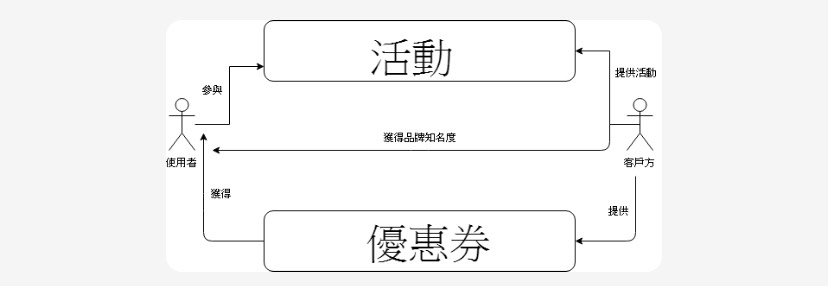
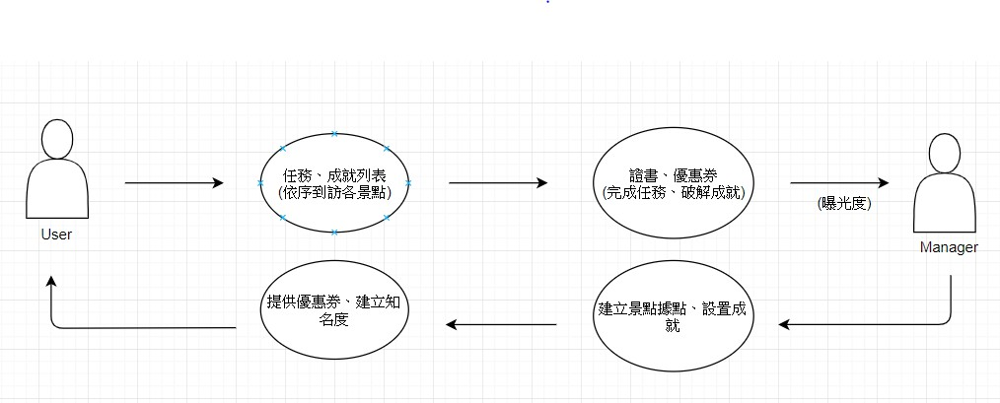
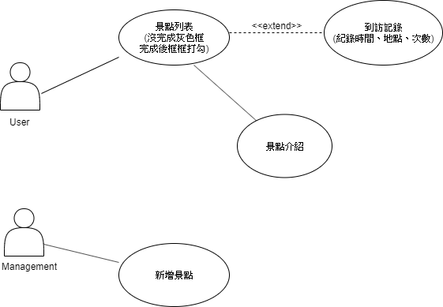

# 主題: 旅遊大亨
***
### 專題需求

### A功能---身為一個{常出去玩的人}，我希望能有{記錄我去過的地點}，以便能讓我{記得去過美麗的景點}

### B功能---身為一個{有收集慾望的人}，我希望能有{成就系統的功能}，以便能讓我{解決強迫症的問題}

### C功能---身為一個{長時間使用社群媒體的人}，我希望能有{分享自己遊玩的圖片在社群媒體上}，以便能讓我{經營社群媒體}
***
### 非功能性需求:此程式應該能隨著使用者走到哪裡記錄到哪裡、能整合當地景點使用者上傳的照片。

### 功能性需求:此程式能能事先規劃景點、提供紀錄功能、誘因制度-如解鎖成就，領取優惠券打卡分享行蹤。
***
### 案例圖

***
### 案例
1.企業可以提供新活動給使用者參加，參加的可以獲得優惠券，企業可以增加知名度，跟政府合作，企業還可以做到社會福利。

2.使用者破取任務、到訪各景點領取證書與優惠券，企業與管理者建立景點，設置成就，提供優惠券，藉此曝光知名度。

3.使用者點入景點列表後，到訪各景點後會點亮(或打勾)原本黯淡的景點標籤，原本已點亮的景點標籤(或打勾)點入後則會進入到訪紀錄的頁面，紀錄時間地點跟次數，也結合觀光局的頁面介紹景點，而管理端則可以新增景點。
***

