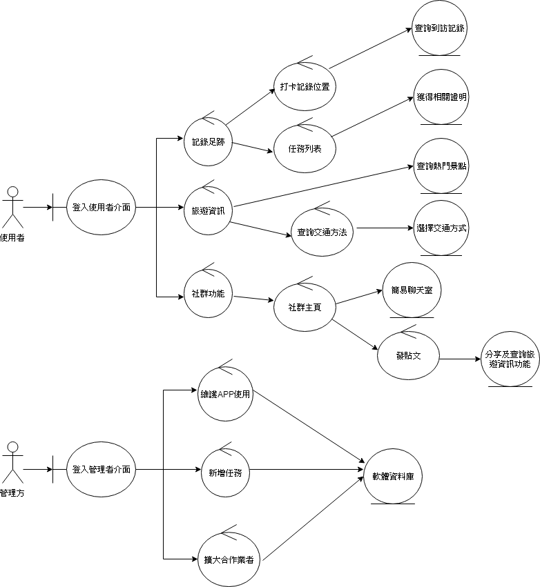

# 主題: 旅遊APP

### 第7組

0624022 顏志祐
0624028 陳億昇
0624044 施宜揚
0624094 張孫杰

### 專題需求

紀錄足跡---使用者點入景點列表後，到訪各景點後會點亮(或打勾)原本黯淡的景點標籤，原本已點亮的景點標籤(或打勾)點入後則會進入到訪紀錄的頁面，記錄時間地點跟次數，也結合觀光局的頁面介紹景點，而管理端則可以新增景點。

獲取成就---使用者破取任務、到訪各景點領取證書與優惠券，企業與管理者建立景點，設置成就，提供優惠券，藉此曝光知名度。

社群---使用者可以使用此功能加入朋友並觀察好友去了哪些地點!企業也可以提供新活動給使用者參加，參加的用戶可以獲得優惠券，企業則能夠增加知名度，與政府合作，增進社會福利。
***
### 重要性排列:
1.紀錄足跡
2.獲取成就
3.社群
***
非功能性需求:促進戶外社群、人性化UI。

功能性需求:此程式能能事先規劃景點、提供紀錄功能、誘因制度-如解鎖成就，領取優惠券打卡分享行蹤，能隨著使用者走到哪裡記錄到哪裡、能整合當地景點使用者上傳的照片。
***
### 案例圖

***
### 使用案例

##### 紀錄足跡
1.使用者使用旅遊APP並提供地點進行出遊前的景點安排

2.旅遊APP根據提供地點規劃出景點路線與設置任務

3.使用者查看APP尋找旅遊依序路線與任務

4.使用者到訪景點打卡分享自己的行程

5.旅遊APP紀錄打卡位置並儲存行程分享

6.使用者按照路線依序遊覽解所成就 破取任務

7.旅遊APP查看是否正確破取成就與任務

  7-1.旅遊APP確認後發放優惠券

8.使用者領取優惠券分享合作店家資訊

9.店家獲取曝光度與知名度

##### 獲取成就

1.使用者想要去高雄的景點玩

2.開啟「旅遊APP」，看有什麼

3.使用APP的景點列表
  
  3-1.GPS開啟定位
  
  3-2.使用者發現附近西子灣沒去過
  
  3-3.使用者出發去西子灣
 
4.使用者到了西子灣

  4-1.使用者按下「旅遊APP」的定位按鈕
  
  4-2.GPS定位抓到使用者在西子灣半徑300M之內
  
  4-3.「旅遊APP」成功紀錄使用者來訪

##### 社群
1.使用者想看其他使用者旅遊去了哪些地方

2.使用者登入旅遊APP，開啟社群網路功能

3.看到其他使用者最後登入時間，去了西子灣又到了駁二特區

  3-1.使用者看了看，很想找人一起去

  3-2.使用者開啟旅遊APP簡易的聊天功能找了其他使用者想一起出門

4.使用者跟其他使用者開心地出門玩

***
### User Story

##### 1.身為一個{使用者}，我希望能有{社群}，以便能讓我{知道朋友去過了哪裡}

##### 2.身為一個{使用者}，我希望能有{獲取成就}，以便能讓我{可以記錄收集的成果}

##### 3.身為一個{使用者}，我希望能有{紀錄足跡}，以便能讓我{記錄曾經到過的地方}

##### 4.身為一個{企業方}，我希望能有{社群}，以便能讓我{分析市場需求}

##### 5.身為一個{企業方}，我希望能有{獲取成就}，以便能讓我{設定富有挑戰性成就}

***
### 初步類型圖

***
### 系統循序圖

***
### 強韌圖

##改類別圖，循序圖，系統循序圖，非功能性需求，企業方user story，使用案例圖變一個使用者

